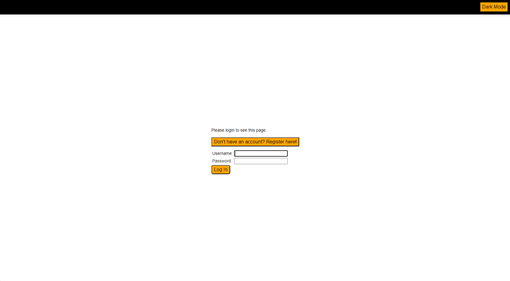
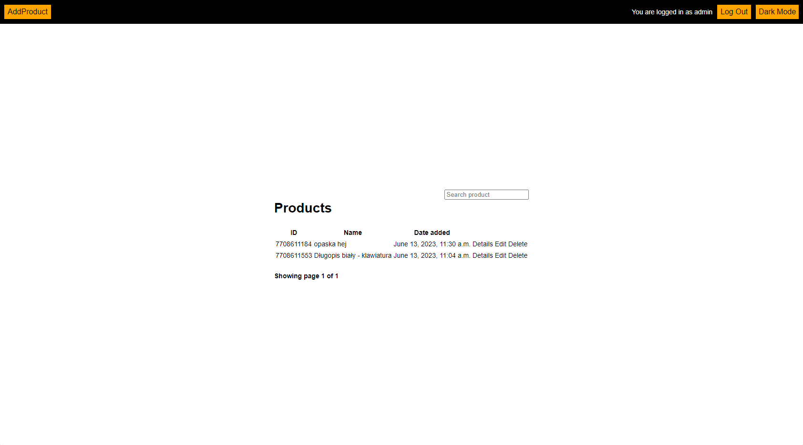
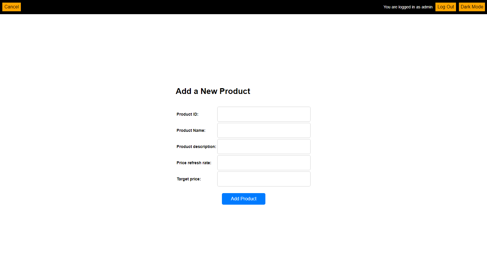
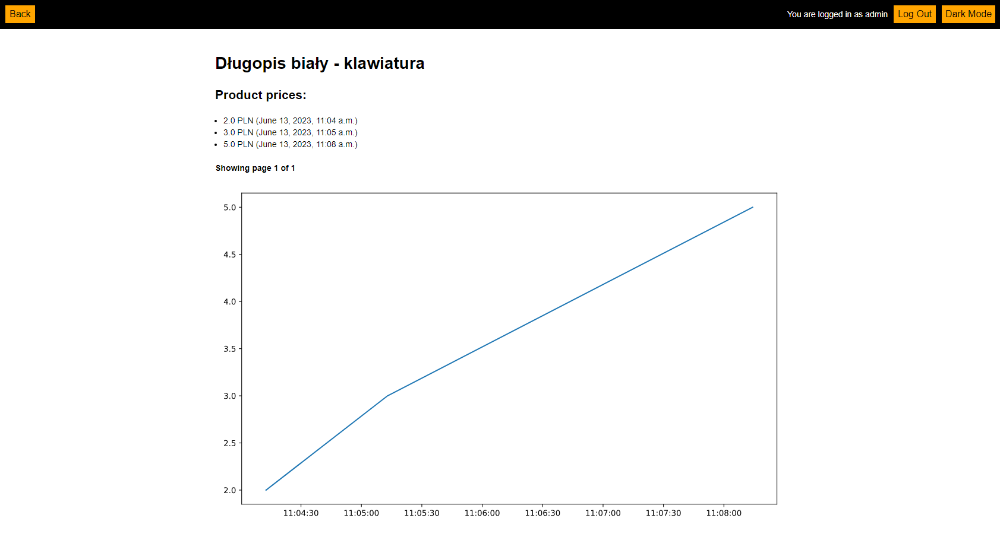

# AllegroTracker
A project created as part of the Software Engineering course at the University of Warsaw.

## About us

<!-- ALL-CONTRIBUTORS-LIST:START - Do not remove or modify this section -->
<!-- prettier-ignore -->
| [<br /><sub><b>Jakub Kuziola</b></sub>](https://github.com/JKuziola)<br />  | [<br /><sub><b>Wojciech Weremczuk</b></sub>](https://github.com/wojsza05)<br /> | [<br /><sub><b>Konrad Mocarski</b></sub>](https://github.com/mocar27)<br /> | [<br /><sub><b>Pawel Dec</b></sub>](https://github.com/koxkox111)<br /> | 
|:----------------------------------------------------------------------------------------------------------------------------------------------------------:|:----------------------------------------------------------------------------------------------------------------------------------------------------------------:|:------------------------------------------------------------------------------------------------------------------------------------------------------------:|:--------------------------------------------------------------------------------------------------------------------------------------------------------------------------------------------------------------------------:|  
<!-- ALL-CONTRIBUTORS-LIST:END -->

### Technologies used


## Project description
A web application that allows you to track products prices on Allegro. User can register and add
products of interest to the watchlist. The app will check the price of the product and send you a notification when
the price drops below the user-specified value.

Since the prices of products on Allegro do not change very often, we have configured our application to work
in the Allegro test environment. For this purpose, we have created an account on Allegro Sandbox, 
which allows you to test the application without having to use real data. We have added a few offers to it, 
which are available at the links listed at the end of this file.

## Using the app
The application has been deployed on Heroku and is available at:
https://allegro-tracker.herokuapp.com/.

So there is no need to run it locally, but if you want to do it, you will find instructions below.

## Running the application locally

Clone the repository and go to the project directory:
```shell
git clone git@github.com:wojsza05/IO.git
cd IO
```

Add file .env in project home directory that contains
SECRET_KEY = <DJANGO KEY>
CLIENT_ID = <ALLEGRO API CLIENT ID>
CLIENT_SECRET = <ALLEGRO API CLIENT SECRET>

Create and activate a virtual environment:
```shell
virtualenv virtual
source virtual/bin/activate
```

Install the required libraries:
```shell
pip install -r requirements.txt
```

Launch the application:
```shell
python3 manage.py runserver
```

You can run Django unit tests writing:
```shell
python3 manage.py test AllegroTracker
```

The application will be available at: http://localhost:8000/.

### Default user
    login: admin
    password: admin

## App appearance
### Login page


### Main page


### Add product


### Detail product view


## Our offers:
- https://allegro.pl.allegrosandbox.pl/oferta/dlugopis-bialy-klawiatura-7708611553
- https://allegro.pl.allegrosandbox.pl/oferta/opaska-hej-7708611184
- https://allegro.pl.allegrosandbox.pl/oferta/zestaw-naprawczy-wiazki-el-drzwi-107065-7708610767
- https://allegro.pl.allegrosandbox.pl/oferta/acer-testowy-309-7708610327
- https://allegro.pl.allegrosandbox.pl/oferta/poduszka-75-x-55-cm-psy-7708610265
- https://allegro.pl.allegrosandbox.pl/oferta/vonala-zawieszka-kot-na-ksiezycu-stylowa-7708609606
